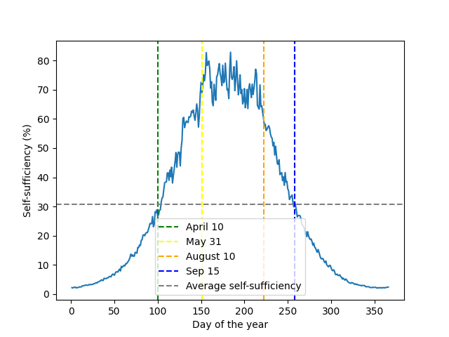

Here’s an updated version of your **README.md** in markdown format, including the additional explanations of the assumptions and international comparisons:

---

# Residential Energy Self-Sufficiency Analysis

This project performs an analysis of **self-sufficiency** for a typical UK semi-detached house by estimating energy demand from heating, hot water usage, household electricity, and electric vehicle (EV) charging, then comparing this demand with the energy generated from a solar PV system. The analysis helps identify how much of the household's energy demand can be met by solar power throughout the year and visualises key trends.

## Project Overview

The goal of this analysis is to assess how self-sufficient a residential property can be using solar energy generation. Key elements analysed include:

- **Solar energy generation** from a PV system.
- **Heating demand**, which varies based on outdoor temperature and the performance of a heat pump.
- **Hot water demand**, with water heating modelled to take advantage of solar generation.
- **Household electricity demand**, modelled using a typical load profile with peaks in the morning and evening.
- **EV charging demand**, which is added to the household electricity demand during specified hours.

The project also calculates **daily and weekly self-sufficiency**, which represents the percentage of the total energy demand that can be met by solar generation.

## Assumptions

We’ve made several assumptions in the analysis to simulate a realistic scenario for a typical UK household:

- **Home Type**: A standard **semi-detached house** with an area of **76 m²**, which is well-insulated to reduce heat loss.
- **Solar PV System**: The house is equipped with an **8 kW solar PV system** installed on **40 m² of roof space**.
- **Hot Water Usage**: Daily hot water consumption is **100 litres**, heated by a **heat pump** with a Coefficient of Performance (COP) of **2.5**.
- **EV Charging**: The household drives an electric vehicle for **10,000 miles/year**, with an efficiency of **0.3 kWh/mile**.
- **Household Electricity**: General household electricity use is set at **10 kWh/day**.

## International Comparisons

For comparison, we looked at solar potential and house sizes in other regions:

- **UK** 🇬🇧: With around **1,300–1,500 hours of sunshine per year**, the UK isn’t known for its abundant solar resources. Still, with modern insulation and efficient solar panels, a semi-detached home (around **76 m²**) can achieve respectable levels of self-sufficiency.
  
- **Spain** 🇪🇸: With **2,500–3,000 hours of sunshine per year** and larger homes (average **97 m²**), Spain offers significantly more potential for solar energy generation.
  
- **Italy** 🇮🇹: Italy enjoys **2,000–2,500 hours of sunshine per year** and similar home sizes (average **81 m²**), making it another country well-suited for residential solar self-sufficiency.

## Key Features

- **Energy Demand Estimation**: Models energy demand for heating, hot water, household electricity, and EV charging, with daily and hourly breakdowns.
- **Solar PV Generation**: Estimates solar generation based on global horizontal irradiance (GHI), panel efficiency, and system losses.
- **Self-Sufficiency Calculation**: Computes the percentage of energy demand met by solar generation on a daily and weekly basis.
- **Visualisation**: Plots trends in self-sufficiency throughout the year, with annotations for key dates and an average self-sufficiency line.

## Requirements

- **Python 3.7+**
- **Pandas**: For data manipulation and analysis.
- **Matplotlib**: For plotting and visualisation.
- **Numpy**: For numerical calculations.
- **Plotly (optional)**: For interactive visualisations.

## Running the Analysis

1. **Data Input**: The project requires a JSON file (`weather_history.json`) that contains historical weather data with fields for temperature, wind speed, and solar irradiance (GHI, DNI, DHI).
   
2. **Run the Script**: The main script performs the following tasks:
   - Loads and processes weather data.
   - Estimates solar power output from a PV system.
   - Calculates heating, hot water, household, and EV electricity demand.
   - Calculates daily and weekly self-sufficiency and visualises the results.

```bash
python energy_analysis.py
```

3. **View Outputs**: The script will generate and display plots showing daily and weekly self-sufficiency throughout the year, with important dates and the average self-sufficiency highlighted.

## Customisation

- **PV System Parameters**: Modify the `SOLAR_CAPACITY_KW`, `SOLAR_EFFICIENCY_FACTOR`, and `system_loss_factor` in the code to adjust the solar generation model.
- **Demand Profiles**: Adjust `HEAT_LOSS_KW_DEG_C`, `HOT_WATER_USAGE`, and `OTHER_ELECTRICITY_USAGE_DAY` to simulate different household demand patterns.
- **EV Charging**: Change the vehicle's annual mileage (`VEHICLE_ANNUAL_MILEAGE`) or charging hours in `estimate_other_demand` to customise EV demand.

4. **Correlation Analysis**

Looking for patterns in correlation between daily solar and gross_demand.


## Example Output

The script produces a plot of daily self-sufficiency throughout the year, with vertical lines indicating key dates (e.g. April 10, May 31, August 10), and a dashed horizontal line representing the average self-sufficiency. Here's an example output:



## Contributions

Feel free to fork this repository, make improvements, and submit pull requests. Any contributions to enhance the functionality or add new features are welcome!

---

This `README.md` gives potential users all the details they need to understand the assumptions, run the analysis, and interpret the results. If you'd like to tweak anything further, feel free to ask!